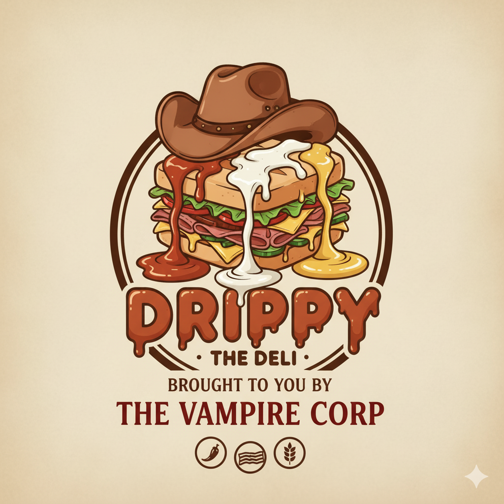
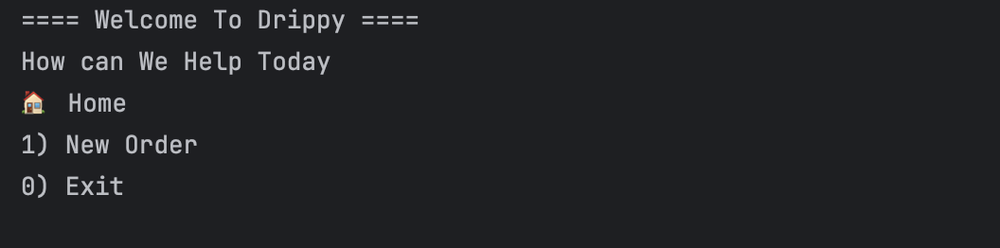
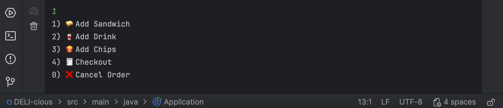
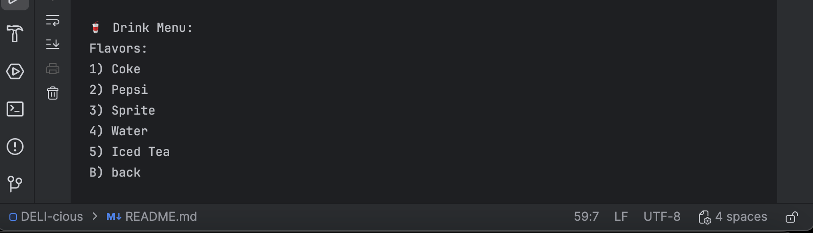
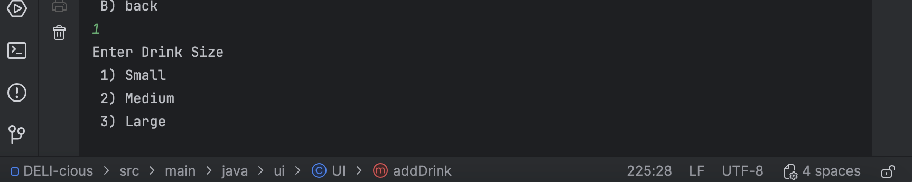
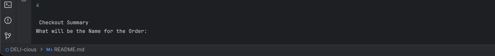
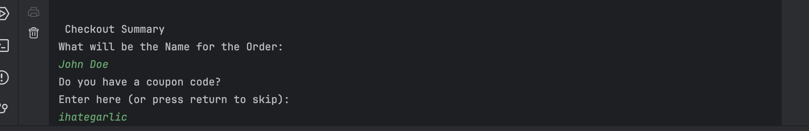
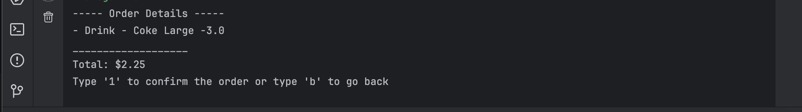
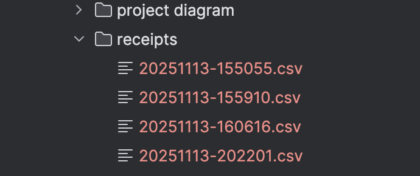
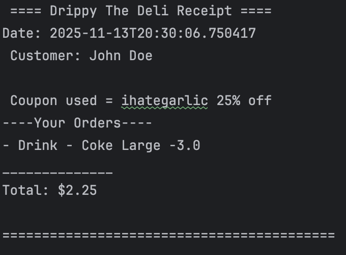

<h1>Drippy Deli Ordering System</h1> 
<div align = center>

</div>

## 🥪 Description
 - This is a Java CLI-based restaurant ordering system where customers can build sandwiches, add drinks and chips.
 - It also includes a feature to apply coupons and automatically generate receipts saved into time stamped files that reflect the time of order completion.

## 🥫 Set Up Instruction
1. Clone the Repository:
  https://github.com/Phannul/capstone-2.git
2. Open the project in a desired code space
3. Ensure you have JDK 17 or above
4. Run Application Java file. 

## 🖥️ Features
* Create fully customizable deli sandwiches 
     - Choose bread, size, toasting and able to choose from variety of toppings
     - Toppings include free and premium
* Add Drinks and Chips
* Checkout confirmation to avoid empty orders
* Special consumer deals:
     - free or doubled price for certain names
* Coupon codes for discounts
    - The coupons include "fanuelisgreat" & "ihategarlic"
* Generates timme stamps for receipt names and also displays time of order completion in the receipt
* Clear Summary display before checkout

# 💻 Technologies Used 

- Language: Java
- JDK: 17
- Maven
- InteliJ IDEA
- Main files(Packages) 
     - UI.java(User Interface)
     - Order.java, Sandwich.java, Toppings.java, Drinks.java, Chips.java, Order.java, Orderables.java (models)
     - ReceiptWriter.java(util)

# 🧑🏽‍💻 User Manual 

### 1. When you start the program the user see the Home Screen
<div align="center">
  
</div>
- Here you can choose to proceed to create a new order from the order screen or exit the program 

### 2. If you enter "1" you'll be presented by the following Screen 
<div align="center">
  
</div>

- This screen will allow you to choose which item you want to add to an order 
- I'll show how to order drinks as an exmaple 
### So if you choose 2 you'll be presented with this screen
<div align="center">
  
</div>

### After Choosing the flavor they like the user would be prompted to choose the size of their beverage
<div align="center">
  
</div>

### After completing the task with the drink it automatically takes you back to the order screen

### Next we'll proceed to checkout 
<div align="center">
  
</div>

### It then takes the name and proceeds to prompt if the user have coupon code

<div align="center">
  
</div>

Note: the user used the "ihategarlic" discount code 

### After doing that it proceeds to show the user the summary of their order and ask for confirmation

<div align="center">
  
</div>

### After confirmation it creates a receipt file and goes back to the Home Screen 

<div align="center">
  
</div>

### At the End the receipt will look like this

<div align="center">
  
</div>

# 📑 Interesting Code Snippet 

```java
private String detectCategory(String toppingName) {
        String lower = toppingName.toLowerCase();
        if (lower.contains("steak") || lower.contains("ham") || lower.contains("salami") ||
                lower.contains("roast beef") || lower.contains("chicken") || lower.contains("bacon")) {
            return "meat";
        } else if (lower.contains("cheddar") || lower.contains("swiss")
                || lower.contains("american") || lower.contains("provolone")) {
            return "cheese";
        } else if (lower.contains("lettuce") || lower.contains("tomato")
                || lower.contains("onion") || lower.contains("pickles")
                || lower.contains("peppers") || lower.contains("mushroom")
                || lower.contains("guacamole") || lower.contains("cucumber")
                || lower.contains("jalapeño")) {
            return "veggie";
        } else if (lower.contains("mayo") || lower.contains("mustard")
                || lower.contains("chipotle") || lower.contains("ranch") ||
                lower.contains("ketchup") || lower.contains("thousand island") || lower.contains("vinaigrette")) {
            return "sauce";
        }
        else {
            return null;
        }
    }

```
This compares the chosen toppings with their corresponding category to ease up Error detection and object creation. 

## Authored by
**Fanuel Birhane**
- Sectioin 3 , Software Pathway
- YUU Dallas,Texas
- Email- fbirhane@my.yearupunited.org
